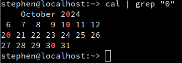
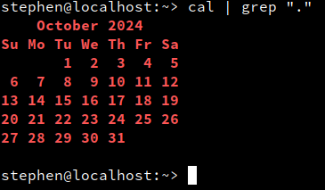
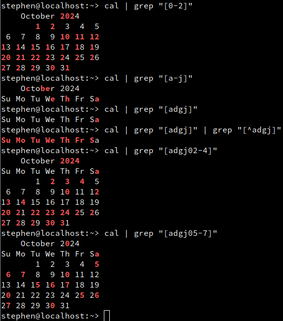
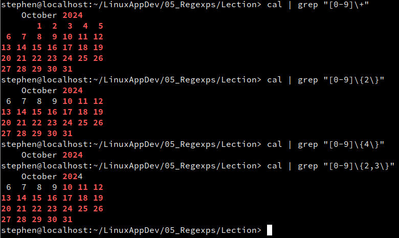
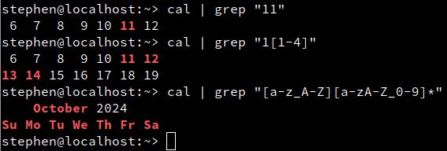
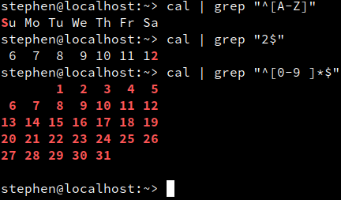
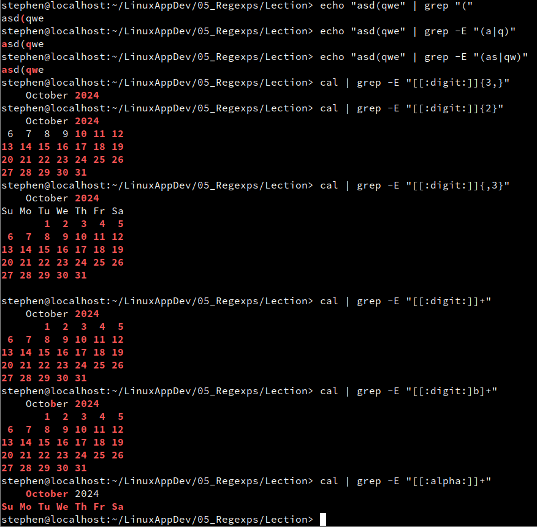

В этом разделе мы обсудим одну из важных задач работы с текстом — сопоставление шаблону — и язык регулярных выражений, как одно из популярных решений этой задачи.

Сопоставление шаблону
---

При работе со строками поиск шаблонов встречается постоянно для уточнения и выделения интересующих нас данных. На основании полученных данных можно принимать решение по фильтрации или редактированию материала.

Шаблон это тоже строка, однако кроме обычных символов в ней также встречаются спецсимволы, позволяющие задавать свойства подстрок интересующего нас набора при поиске. Если при сопоставлении наши спецсимволы могут быть проинтерпретированы так, что шаблоны совпадают, поиск считается успешным.

Один из примитивных языков шаблонов представлен в `Shell` и основанных на его логике функциях Си. Применяется он преимущественно для проверок соответствия пути файлов.

Язык регулярных выражений
---
Регулярные выражения (Regular Expressions — `RegEx`s) описывается подклассом регулярных грамматик, называемым автоматными грамматиками. Это самый строгий из формальных языков по классификации Хомского (почитать про это можно вот [тут](https://clck.ru/3E46d6)), который описывается детерминированными и недетерминированными конечными автоматами.

Язык регулярных выражений не является полным, основная проблема работы с ним — независимость от контекста нашего шаблона. Это значит, что чем больше и разнообразнее контекст, тем сложнее написать регулярное выражение для поиска нужных нам конструкций. Не слишком удобно, хотя вполне возможно, с помощью регулярных выражений разбирать комментарии или строковые константы в языках программирования, а вот скобочные конструкции (с учётом парных скобок) вообще не поддаются разбору одними только `RegEx`.

Ещё один минус `RegEx` заключается в том, что это "птичий язык". Конструкции языка настолько перегружают общий вид шаблона, что если с написанием выражения проблем не возникнет, то прочтение станет просто невозможным.

Принцип сопоставления шаблону регулярных выражений описывается фразой "Сначала самый левый, потом самый длинный". При несовпадении шаблона происходит откат проверки на ближайший недетерминированный переход и пробуется иная подстановка.

Алгоритм NFA (с откатом): ищем "abb*" в "aabbb":
 + "**a**abbb" → "**a**bb*"
 +  нет соответствия для "b", откат на следующее соответствие для "a"
 + "a**a**bbb" → "**a**bb*"
 + "a**ab**bb" → "**ab**b*"
 +  "a**abbb**" → "**`abb*`**"


По `RegEx` есть отдельная [книжка](http://regex.info/book.html), которая даёт хорошее понимание интерпретации шаблона, а также воспитывает ощущение, где регулярные выражения справляются, а где нет

Работа с регулярными выражениями
---
Классическая утилита, использующая регулярные выражения — упоминаемый нами в предыдущих разделах `grep`. Как мы помним из историии его происхождения, `grep` как раз совершает глобальный поиск шаблона `RegEx` по входному потоку, после чего выводит найденные элементы на экран.


**Настоятельно рекомендуем самостоятельно попробовать прогнать все примеры для наглядности и собственного понимания! Утилита grep умеет раскрашивать найденный шаблон (как на картинке выше), но в текстовых примерах это теряется… ☹**

Разберём основные элементы, из которых строится регулярное выражение:

+ Любой точный символ


```console
admin@localhost:~/LinuxAppDev/05_Regexps/Lection> cal | grep "0"
    October 2024    
 6  7  8  9 10 11 12
20 21 22 23 24 25 26
27 28 29 30 31      
admin@localhost:~/LinuxAppDev/05_Regexps/Lection>
```

+ точка `.` описывает строго один любой символ


```console
admin@localhost:~/LinuxAppDev/05_Regexps/Lection> cal | grep "."
    October 2024    
Su Mo Tu We Th Fr Sa
       1  2  3  4  5
 6  7  8  9 10 11 12
13 14 15 16 17 18 19
20 21 22 23 24 25 26
27 28 29 30 31      
                    
admin@localhost:~/LinuxAppDev/05_Regexps/Lection>
```

+ диапазон `[ ]` позволяет описывать набор подходящих под сопоставление элементов. Мы можем описывать просто список элементов, указывать последовательность символов через её границы и `-`, а также описывать отрицание заданного диапазона с помощью `^` (подходит всё кроме указанного)


```console
admin@localhost:~/LinuxAppDev/05_Regexps/Lection> cal | grep "[0-2]"
    October 2024    
       1  2  3  4  5
 6  7  8  9 10 11 12
13 14 15 16 17 18 19
20 21 22 23 24 25 26
27 28 29 30 31      
admin@localhost:~/LinuxAppDev/05_Regexps/Lection> cal | grep "[a-j]"
    October 2024    
Su Mo Tu We Th Fr Sa
admin@localhost:~/LinuxAppDev/05_Regexps/Lection> cal | grep "[adgf]"
Su Mo Tu We Th Fr Sa
admin@localhost:~/LinuxAppDev/05_Regexps/Lection> cal | grep "[adgf02-4]"
    October 2024    
Su Mo Tu We Th Fr Sa
       1  2  3  4  5
 6  7  8  9 10 11 12
13 14 15 16 17 18 19
20 21 22 23 24 25 26
27 28 29 30 31      
admin@localhost:~/LinuxAppDev/05_Regexps/Lection> cal | grep "[adgf05-7]"
    October 2024    
Su Mo Tu We Th Fr Sa
       1  2  3  4  5
 6  7  8  9 10 11 12
13 14 15 16 17 18 19
20 21 22 23 24 25 26
27 28 29 30 31      
admin@localhost:~/LinuxAppDev/05_Regexps/Lection>cal | grep "[^adgf]"
    October 2024    
       1  2  3  4  5
 6  7  8  9 10 11 12
13 14 15 16 17 18 19
20 21 22 23 24 25 26
27 28 29 30 31      
admin@localhost:~/LinuxAppDev/05_Regexps/Lection>
```

+ Объединение `()` позволяет описывать несколько раздельных шаблонных конструкций, как единое целое. Однако сами по себе скобки не являются спецсимволами, для обозначения их как конструкции языка необходимо их экранировать с помощью `\`


```console
admin@localhost:~/LinuxAppDev/05_Regexps/Lection> cal | grep "\([01][34]\)"
13 14 15 16 17 18 19
admin@localhost:~/LinuxAppDev/05_Regexps/Lection>
```

+ Объединение необходимо для работы с повторителями. В классических регулярных выражениях есть единственный неэкранирующийся повторитель `*`, обозначающий наличие выделенного элемента в итоговом шаблоне 0 или более раз.

Кроме него есть ещё экранируемый повторитель `+`, обозначающий наличие выделенного элемента в итоговом шаблоне 1 или более раз,  `?` (ноль или один раз, не больше), а также повторяющий диапазон `{ }`, в который указывается последовательность интересующих нас количеств повторений (при указании в формате `{<число>,}` будут браться все значения, больше-равные заданному. Аналогично для  `{,<число>}`).


```console
admin@localhost:~/LinuxAppDev/05_Regexps/Lection> cal | grep "1*"
    October 2024    
Su Mo Tu We Th Fr Sa
       1  2  3  4  5
 6  7  8  9 10 11 12
13 14 15 16 17 18 19
20 21 22 23 24 25 26
27 28 29 30 31      
                    
admin@localhost:~/LinuxAppDev/05_Regexps/Lection> cal | grep "[0-9]*"
    October 2024    
Su Mo Tu We Th Fr Sa
       1  2  3  4  5
 6  7  8  9 10 11 12
13 14 15 16 17 18 19
20 21 22 23 24 25 26
27 28 29 30 31      
                    
admin@localhost:~/LinuxAppDev/05_Regexps/Lection> cal | grep "\([01][34]\)*"
    October 2024    
Su Mo Tu We Th Fr Sa
       1  2  3  4  5
 6  7  8  9 10 11 12
13 14 15 16 17 18 19
20 21 22 23 24 25 26
27 28 29 30 31      
                    
admin@localhost:~/LinuxAppDev/05_Regexps/Lection>
```
Как мы могли заметить,  `grep` обрабатывает данные построчно и выводит строку только в случае нахождения в ней шаблона. В данных примерах шаблон находился всегда, потому что в каждой строке происходило совпадение с шаблоном, состоящим из, как минимум, нуля элементов (даже в пустой строке после календаря)



```console
admin@localhost:~/LinuxAppDev/05_Regexps/Lection> cal | grep "[0-9]\+"
    October 2024    
       1  2  3  4  5
 6  7  8  9 10 11 12
13 14 15 16 17 18 19
20 21 22 23 24 25 26
27 28 29 30 31      
admin@localhost:~/LinuxAppDev/05_Regexps/Lection> cal | grep "[0-9]\{2\}"
    October 2024    
 6  7  8  9 10 11 12
13 14 15 16 17 18 19
20 21 22 23 24 25 26
27 28 29 30 31      
admin@localhost:~/LinuxAppDev/05_Regexps/Lection> cal | grep "[0-9]\{4\}"
    October 2024    
admin@localhost:~/LinuxAppDev/05_Regexps/Lection> cal | grep "[0-9]\{2,3\}"
    October 2024    
 6  7  8  9 10 11 12
13 14 15 16 17 18 19
20 21 22 23 24 25 26
27 28 29 30 31      
admin@localhost:~/LinuxAppDev/05_Regexps/Lection>
```

В последнем примере `grep` самопроизвольно переключился на расширенные 

+ Составные регулярные выражения — регулярные выражения, состоящие из регулярных выражений


```console
admin@localhost:~/LinuxAppDev/05_Regexps/Lection> cal | grep "11"
 6  7  8  9 10 11 12
admin@localhost:~/LinuxAppDev/05_Regexps/Lection> cal | grep "1[1-4]"
 6  7  8  9 10 11 12
13 14 15 16 17 18 19
admin@localhost:~/LinuxAppDev/05_Regexps/Lection> cal | grep "[a-z_A-Z][a-zA-Z_0-9]*"
    October 2024    
Su Mo Tu We Th Fr Sa
```

+  Отдельно упомянем спецсимволы позиционирования: они описывают расположение регулярного выражения относительно начала строки(`^`) и конца строки(`$`)


```console
admin@localhost:~/LinuxAppDev/05_Regexps/Lection> cal | grep "^[A-Z]"
Su Mo Tu We Th Fr Sa
admin@localhost:~/LinuxAppDev/05_Regexps/Lection> cal | grep "2$"
 6  7  8  9 10 11 12
admin@localhost:~/LinuxAppDev/05_Regexps/Lection> 
admin@localhost:~/LinuxAppDev/05_Regexps/Lection> cal | grep "^[0-9 ]*$"
       1  2  3  4  5
 6  7  8  9 10 11 12
13 14 15 16 17 18 19
20 21 22 23 24 25 26
27 28 29 30 31      
                    
admin@localhost:~/LinuxAppDev/05_Regexps/Lection>
```


Расширенные регулярные выражения
---

Как мы уже упоминали, важную роль в определении спецсимволов играет символ экранирования `\`. Однако его обработка, а также читабельность шаблона при его наличии это очень непростые задачи. Даже Shell, постоянно сталкивающийся с экранированием, не может победить его однозначно понятным образом:

```console
admin@localhost:~/LinuxAppDev/05_Regexps/Lection> zsh
localhost% echo "\\"
\
localhost% echo "\\\\"
\
localhost% echo "\\\\\\"
\\
localhost% echo "\\\"   
dquote> 
localhost% 
```

Чтобы уменьшить кол-во экранирований, был разработан специальный диалект — т. н. [расширенные регулярные выражения](https://man7.org/linux/man-pages/man7/regex.7.html). В него были добавлены все спецсимволы, которые до этого обретали свои свойства через экранирование, отчего читабельность шаблона возрастает в разы:


```console 
admin@localhost:~> echo "asd(qwe" | grep "("
asd(qwe
admin@localhost:~> echo "asd(qwe" | grep -E "(a|b)"
asd(qwe
admin@localhost:~> echo "asd(qwe" | grep -E "(a|q)"
asd(qwe
admin@localhost:~> echo "asd(qwe" | grep -E "(as|qw)"
asd(qwe
admin@localhost:~> 
```

Кроме экранированных команд в расширенных регулярных выражениях появились встроенные классы символов, обращение к которым осуществляется через конструкцию `[[: :]]`
```console
admin@localhost:~> cal | grep -E "[[:digit:]]{3,}"
    October 2024    
admin@localhost:~> cal | grep -E "[[:digit:]]{2}"
    October 2024    
 6  7  8  9 10 11 12
13 14 15 16 17 18 19
20 21 22 23 24 25 26
27 28 29 30 31      
admin@localhost:~> cal | grep -E "[[:digit:]]{,3}"
    October 2024    
Su Mo Tu We Th Fr Sa
       1  2  3  4  5
 6  7  8  9 10 11 12
13 14 15 16 17 18 19
20 21 22 23 24 25 26
27 28 29 30 31      
                    
admin@localhost:~> cal | grep -E "[[:digit:]]+"
    October 2024    
       1  2  3  4  5
 6  7  8  9 10 11 12
13 14 15 16 17 18 19
20 21 22 23 24 25 26
27 28 29 30 31      
admin@localhost:~> cal | grep -E "[[:digit:]b]+"
    October 2024    
       1  2  3  4  5
 6  7  8  9 10 11 12
13 14 15 16 17 18 19
20 21 22 23 24 25 26
27 28 29 30 31      
admin@localhost:~> cal | grep -E "[[:alpha:]]+"
    October 2024    
Su Mo Tu We Th Fr Sa
admin@localhost:~> 

```

Поиск с заменой
---

Одна из задач, в которой возникает задача сопоставления по шаблону, это замена по шаблону. При этом для замены не просто какими-то константными выражениями, а с использованием данных найденного по шаблону выражения в языке регулярных выражений существует `back-reference` обозначение элементов шаблона. Все пары группирующих круглых скобок из шаблона нумеруются начиная с `1` (по ходу появления открывающих скобок), и для подстановки фрагмента строки, соответствующего шаблону внутри этих скобок, используется конструкция '`\номер`', где `нoмер` — это и есть номер группы.


```console
admin@localhost:~> cal
    October 2024    
Su Mo Tu We Th Fr Sa
       1  2  3  4  5
 6  7  8  9 10 11 12
13 14 15 16 17 18 19
20 21 22 23 24 25 26
27 28 29 30 31      
                    
admin@localhost:~> cal | grep -E "([[:digit:]]).\1"
    October 2024    
 6  7  8  9 10 11 12
20 21 22 23 24 25 26
admin@localhost:~> # \1 — back-reference
admin@localhost:~> # 202 | 1 1 | 2 2
admin@localhost:~> 
admin@localhost:~> 
```

Замена по шаблону из командной строки Linux обычно делается с помощью [потокового текстового редактора sed](https://ru.wikipedia.org/wiki/Sed). _Массовое_ применение `sed` на этом и заканчивается, однако он стоит изучения и как отдельный самостоятельный инструмент. Его язык состоит из двух дюжин команд, и при этом он алгоритмически полон!


```console
admin@localhost:~> cal | sed 's/2024/1666/'
    October 1666    
Su Mo Tu We Th Fr Sa
       1  2  3  4  5
 6  7  8  9 10 11 12
13 14 15 16 17 18 19
20 21 22 23 24 25 26
27 28 29 30 31      
                    
admin@localhost:~> cal | sed 's/2/_/'
    October _024    
Su Mo Tu We Th Fr Sa
       1  _  3  4  5
 6  7  8  9 10 11 1_
13 14 15 16 17 18 19
_0 21 22 23 24 25 26
_7 28 29 30 31      
                    
admin@localhost:~> cal | sed 's/2/_/g'
    October _0_4    
Su Mo Tu We Th Fr Sa
       1  _  3  4  5
 6  7  8  9 10 11 1_
13 14 15 16 17 18 19
_0 _1 __ _3 _4 _5 _6
_7 _8 _9 30 31      
                    
admin@localhost:~> 

```

```console
admin@localhost:~> cal | sed -E 's/([[:digit:]])(.)([[:digit:]])/\3\2\1/g'
    October 2024    
Su Mo Tu We Th Fr Sa
       1  2  3  4  5
 6  7  8  1 91 01 12
11 31 41 51 61 71 89
22 02 12 22 32 42 56
22 72 83 93 01      
                    
admin@localhost:~> 

```

```console
admin@localhost:~> date
Tue Oct 15 05:13:05 PM MSK 2024
admin@localhost:~> date | sed -E "s/(([[:digit:]]+).*)([[:digit:]]+)/<1=\1><2=\2><3=\3>/"
Tue Oct <1=15 05:13:05 PM MSK 202><2=15><3=4>
admin@localhost:~> 

```


Регулярные выражения на Си
---
В Си для работы с регулярными выражениями есть отдельная библиотека [regex.h](https://man7.org/linux/man-pages/man3/regcomp.3.html), умеющая обрабатывать шаблонные строки и проводить сопоставление по шаблону в строке. 

Напишем простую программу, получающую в аргументах командной строки регулярное выражение и проводящую поиск по входному потоку строк. Строки будем считывать функцией `getline`, которая автоматически выделяет память под них, вследствие чего после каждого считывания и обработки строки будет необходимо память освобождать.

 `gre.c`
```c
#include <stdio.h>
#include <stdlib.h>
#include <regex.h>

int main(int argc, char** argv) {
    char* buf;
    size_t len = 0;
    int chars;

    regex_t regex; // переменная для хранения RegEx
    regcomp(&regex, argv[1], 0); // Этой функцией приходящую строку интерпретируем, как регулярное выражение

    for (buf = NULL; (chars = getline(&buf, &len, stdin)) != -1; buf = NULL) {
        buf[chars-1] = 0;
        
        if (regexec(&regex, buf, 0, NULL, 0) == 0) { // если поиск успешный, выводим строку
            puts(buf);
        }
        
        free(buf); // не забываем освобождать память
    }
    regfree(&regex); // и освобождать память для регулярного выражения
    return 0;
}
```

```console
admin@localhost:~/LinuxAppDev/05_Regexps/Lection> cc gre.c -o gre
admin@localhost:~/LinuxAppDev/05_Regexps/Lection> ./gre "p.*s" < gre.c
            puts(buf);
admin@localhost:~/LinuxAppDev/05_Regexps/Lection> 
```

Добавим обработку ошибок для приходящего шаблона

`gre.c`
```c
#include <stdio.h>
#include <stdlib.h>
#include <unistd.h>
#include <regex.h>

int main(int argc, char** argv) {
    char* buf;
    size_t len = 0;
    int chars;

    regex_t regex;
    

    if (regcomp(&regex, argv[1], 0)) {
    	_exit(1);
    }

    for (buf = NULL; (chars = getline(&buf, &len, stdin)) != -1; buf = NULL) {
        buf[chars-1] = 0;
        
        if (regexec(&regex, buf, 0, NULL, 0) == 0) {
            puts(buf);
        }
        
        free(buf);
    }
    regfree(&regex);
    return 0;
}
```

```console
admin@localhost:~/LinuxAppDev/05_Regexps/Lection> cc gre.c -o gre
admin@localhost:~/LinuxAppDev/05_Regexps/Lection> ./gre "p.*s" < gre.c || echo OOPS
            puts(buf);
admin@localhost:~/LinuxAppDev/05_Regexps/Lection> ./gre "p\(" < gre.c || echo OOPS # некорректное регулярное выражение
OOPS
admin@localhost:~/LinuxAppDev/05_Regexps/Lection> 
```

Теперь попробуем выделить в каждом найденном шаблоне подвыражения, из которых он состоит. Для этого в функции сопоставления по шаблону `regexec` есть отдельные параметры для массива подвыражений и его размера.  

`gre.c`
```c
#include <stdio.h>
#include <stdlib.h>
#include <unistd.h>
#include <regex.h>

#define MAXGR 10

int main(int argc, char** argv) {
    char* buf;
    size_t len = 0;
    int chars, begin, end;

    regex_t regex;
    regmatch_t bags[MAXGR]; // Массив подвыражений
    

    if (regcomp(&regex, argv[1], 0)) {
    	_exit(1);
    }

    for (buf = NULL; (chars = getline(&buf, &len, stdin)) != -1; buf = NULL) {
        buf[chars-1] = 0;
        
        if (regexec(&regex, buf, MAXGR, bags, 0) == 0) { //кроме сопоставления разбиваем результат на подвыражения
        	for (int i = 0; i < MAXGR && bags[i].rm_so >= 0; i++ ) {
        		begin = bags[i].rm_so; // в массиве не хранятся строки, лишь индексы начала и конца подвыражений в результате
        		end = bags[i].rm_eo;
        		printf("%d: %.*s\n", i, end - begin, buf + begin); //нулевой элемент массива хранит индексы для всей строки, каждый следующий хранит индексы своего подвыражения
        	}
        }
        
        free(buf);
    }
    regfree(&regex);
    return 0;
}
```

```console
admin@localhost:~/LinuxAppDev/05_Regexps/Lection> cc gre.c -o gre
admin@localhost:~/LinuxAppDev/05_Regexps/Lection> cal
    October 2024    
Su Mo Tu We Th Fr Sa
       1  2  3  4  5
 6  7  8  9 10 11 12
13 14 15 16 17 18 19
20 21 22 23 24 25 26
27 28 29 30 31      
                    
admin@localhost:~/LinuxAppDev/05_Regexps/Lection> cal | ./gre "\(2\)\(.*\)\(3\)"
0: 2  3      # всё выражение
1: 2         # его
2:           # составные
3: 3         # части
0: 20 21 22 23
1: 2
2: 0 21 22 2
3: 3
0: 27 28 29 30 3
1: 2
2: 7 28 29 30 
3: 3
admin@localhost:~/LinuxAppDev/05_Regexps/Lection> 
```

В Си также есть поддержка расширенных регулярных выражений

`gre.c`
```c
#include <stdio.h>
#include <stdlib.h>
#include <unistd.h>
#include <regex.h>

#define MAXGR 10

int main(int argc, char** argv) {
    char* buf;
    size_t len = 0;
    int chars, begin, end;

    regex_t regex;
    regmatch_t bags[MAXGR];
    

    if (regcomp(&regex, argv[1], REG_EXTENDED)) { // используем расширенные RegEx
    	_exit(1);
    }

    for (buf = NULL; (chars = getline(&buf, &len, stdin)) != -1; buf = NULL) {
        buf[chars-1] = 0;
        
        if (regexec(&regex, buf, MAXGR, bags, 0) == 0) {
        	for (int i = 0; i < MAXGR && bags[i].rm_so >= 0; i++ ) {
        		begin = bags[i].rm_so;
        		end = bags[i].rm_eo;
        		printf("%d: %.*s\n", i, end - begin, buf + begin);
        	}
        }
        
        free(buf);
    }
    regfree(&regex);
    return 0;
}
```

```console
admin@localhost:~/LinuxAppDev/05_Regexps/Lection> cc gre.c -o gre
admin@localhost:~/LinuxAppDev/05_Regexps/Lection> cal | ./gre "(2)(.*)(3)"
0: 2  3
1: 2
2:   
3: 3
0: 20 21 22 23
1: 2
2: 0 21 22 2
3: 3
0: 27 28 29 30 3
1: 2
2: 7 28 29 30 
3: 3
admin@localhost:~/LinuxAppDev/05_Regexps/Lection> 
```

Послесловие
---
Как мы уже говорили, регулярные выражения не могут решить все задачи по распознаванию текстов. Чуть больший спектр возможностей предоставляет **_язык нерегулярных выражений_**, примером которого являются PCRE или "Регулярные выражения Python". Из важных отличий от классических `RegEx`s они имеют иную логику работы ("Самый левый — самый короткий") (её же называют _логикой нежадных повторителей_), а также пред- и постпросмотр — сопоставление шаблона с дополнительными начальными или конечными подвыражениями, которые участвуют лишь в поиске, но не в матчинге шаблона.

Домашнее задание
---
1. Написать программу `esub` с параметрами `regexp substitution string`, которая работает примерно как `echo 'string' | sed -E 's/regexp/substitution/'` (однократная замена). _**Предупреждение**_: надо уметь программировать на Си.
	1. Используются [расширенные регулярные выражения](http://man7.org/linux/man-pages/man7/regex.7.html "man7") (так меньше «\»)
	2. Программа должна распознавать ошибки в регулярном выражении и выводить соответствующую диагностику с помощью [regerror](http://man7.org/linux/man-pages/man3/regerror.3.html "man3")
	3. В строке `substitution` программа должна распознавать ссылки на соответствующие «карманы» (самих карманов 9, ссылок может быть не более 100). Также должны распознаваться и ссылки на _несуществующие_ карманы (например, \9 если в выражении нет стольких пар скобок — это ошибка), и конструкция «\\\», которая должна заменяться на «\»
2. _Необязательное усложнение_: реализовать режим раскрашивания (как в `grep`, только лучше), в котором подстановка из каждого кармана окрашивается в свой цвет
3. Написать `Makefile`, в который включить сборку, удаление генератов и тесты, где вывод `esub` сравнивается с выводом соответствующей команды `sed -E s/…/…/`
