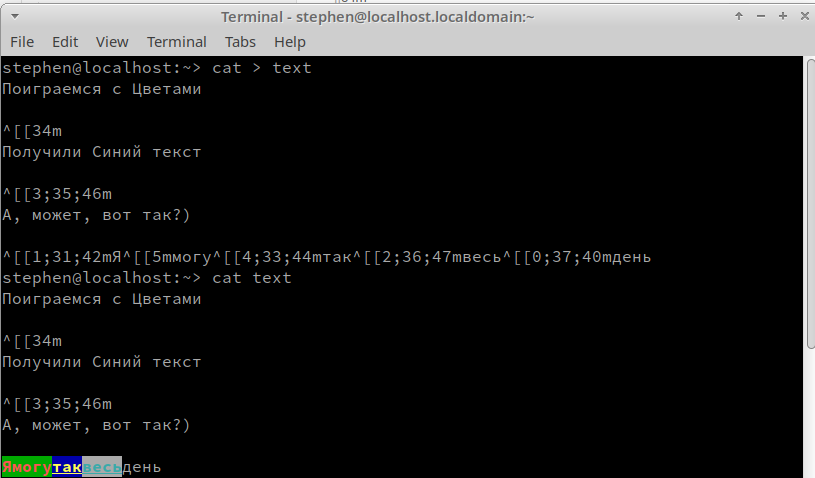
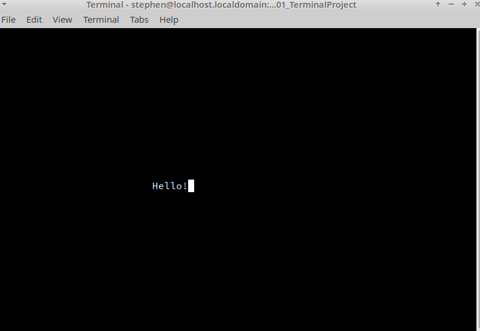

   Данный раздел будет посвящён основному устройству, через которое так или иначе проводится всё взаимодействие с кишочками компьютера руками программиста - терминалу. Так сказать, от человеческих целей что-то сделать компьютером до непосредственной реализации этого чего-то, терминал это самый простой способ.
   
# Немного теории про терминал

Терминал - это устройство, которое обеспечивает ввод-вывод байтов на компьютер. Ровным счётом, всё. Никаких волшебных свойств, накрученных механизмов. Просто что-то, куда можно вводить байты и откуда их можно получать, плюс минимальная подкапотная обработка для перевода с символьного языка на машинные команды.


Работать с компьютером вслепую было очень неудобно. Да, у тебя есть куча перфокарт, которые можно заранее под каждое действие компьютера прописать, но человеческий фактор никто не отменял, и хотелось бы при возникновении какой-то ошибки не перечитывать выколотые точки на бумажке и не искать, где какая информационная лампочка у компьютера загорелась, а вот в одно место куда-то получать ответ. А если с этого места можно будет эти самые команды компьютеру передавать вместо кучи перфокарт, так ещё и делать это прямо во время работы, жить стало бы сильно проще.

Первым терминалом стал [Телетайп](https://ru.wikipedia.org/wiki/Телетайп). Он представлял из себя пишущую машинку, подключённую к компьютеру, которая печатает на бумажку текст, после чего этот текст можно было автоматически загнать в компьютер, он обрабатывался, как последовательность байт, отрабатывал команду, после чего на бумажку выводил ответ.

Это нововведение в те годы произвело невероятный скачок в работе с ЭВМ. Ничего роднее пишущей машинки для человека того времени не было. Более того, было понятно, как и эту вещь можно дальше улучшать и модифицировать. С приходом в общее пользование электронно-лучевых трубок бумажная лента заменилась на экран, но идеи, которые вложили тогда для работы через терминал, живут и актуальны до сих пор. Просто потому что лучше придумывать и не надо, всё уже максимально адаптировано.

Телетайпы стали настолько неотъемлемой частью компьютера, что современные технологии кишат отсылками на это явление:
1. Порты в файловой системе Unix-подобных систем до сих пор называются `/dev/tty` как сокращение от `/devices/teletypes`
2. `telnet` — сетевой протокол для реализации текстового терминального интерфейса по сети - также имеет своё название именно благодаря телетайпам (***teletype network***)

Также ещё с тех времён остались классические текстовые построчные редакторы. Да, "на листочке" работу с полным файлом трудно делать.  А построчно смотреть, изменять итд - вполне))

Рассмотрим небольшой примерчик с использованием одного из таких редакторов `ed`

```
stephen@localhost:~> cat text 
First str
Second str
Third str

stephen@localhost:~> ed text 
31 # количество символов в файле
P # Включить редактирование
*3 # Переместиться на 3ю строку
Third str
*3i # Добавить строку до указанной
Hehehe
.
*,p # построчно отобразить весь файл
First str
Second str
Hehehe
Third str
*1
First str
*s/First/Hahaha  # замена в строке
Hahaha str
*,p
Hahaha str
Second str
Hehehe
Third str
*w # Сохранить...
39
*q # ... и выйти

stephen@localhost:~> cat text 
Hahaha str
Second str
Hehehe
Third str

stephen@localhost:~> 

```

Управление через терминал
---

Итак, с историей всё понятно. Основная мысль: "Терминал - основа управления компьютером". Но отсюда идёт логичный вопрос: а как управлять? Просто писать команды? А если я хочу просто текст в виде команды написать, а не команду? Нужно как-то отделять, когда мы вводим просто символы, а когда управляющие команды.

Именно с такими размышлениями разработчики той самой логики работы терминала выделили некоторые байты в качестве управляющих, а, в последствии, к ним добавились и целые наборы символов. Так появился термин "Escape-последовательность" *(EscSeq далее по тексту)*, обозначающий те самые управляющие команды, которые вводились ровно так же, как и обычные байты, но обрабатывались компьютером иначе отдельно от текста. Так, н-р, EcsSeq `Ctrl+C` воспринимается, как сигнал прерывания обработки текущей команды.

Полный список управляющих байт, обрабатываемых при работе в терминале, а также другие его характеристики можно посмотреть с помощью команды `stty`

`stephen@localhost:~> stty -a`
`speed 38400 baud; rows 24; columns 80; line = 0;`
`intr = ^C; quit = ^\; erase = ^?; kill = ^U; eof = ^D; eol = <undef>;`
`eol2 = <undef>; swtch = <undef>; start = ^Q; stop = ^S; susp = ^Z; rprnt = ^R;`
`werase = ^W; lnext = ^V; discard = ^O; min = 1; time = 0;`
`-parenb -parodd -cmspar cs8 -hupcl -cstopb cread -clocal -crtscts`
`-ignbrk -brkint -ignpar -parmrk -inpck -istrip -inlcr -igncr icrnl ixon -ixoff`
`-iuclc -ixany -imaxbel iutf8`
`opost -olcuc -ocrnl onlcr -onocr -onlret -ofill -ofdel nl0 cr0 tab0 bs0 vt0 ff0`
`isig icanon iexten echo echoe echok -echonl -noflsh -xcase -tostop -echoprt`
`echoctl echoke -flusho -extproc`

Всё из тех же времён пишущих машинок в современные терминалы дотянулись основные преобразования ввода-вывода:
1. Разные режимы работы с вводом - `Cooked mode` и `raw mode`.
	Работа терминала "на бумажке" предполагала сначала ввод команды, а после запуск её в обработку (`cooked mode`). В случае с электронной обработкой стала доступна возможность сразу обрабатывать вводимые символы и EcsSeq без подтверждения ввода(`raw mode`)
2. Игры с переводом строки
	В процессе записи команды с использованием пишущей машинки была возможность перемещать каретку по шагам табуляции или просто в начало, а также ставить обозначения конца строки отметками от той самой каретки. Идеи сохранились и сейчас в виде EscSeq и отдельных управляющих символов. Правда, тут есть проблемы с унификацией: у одного только Windows есть 5 вариантов символаконца строки... В Linux получше, однако их вид, увы, не унифицирован от системы к системе
3. Примитивное редактирование ввода-вывода
	Для редактирования текста в пишущей машинке использовались возможности сдвига каретки; так, например, для подчёркивания символа каретку отгоняли назад и печатали подчёркивание поверх (`хе, получается "под низ"`) символа, длясоздания жирного шрифта делали множественную повторную печать. В современных терминалах такие изменения ровно так же и отмечаются
	
	```
	TODO:  Написать пример с показанией старого формата редактирования
	```

	Сейчас такое же  редактирование можно повторить и с помощью EcsSeq:

```
stephen@localhost:~> bold=$(tput bold)
stephen@localhost:~> normal=$(tput sgr0)
stephen@localhost:~> echo "Really ${bold}bold${normal} text" > text
stephen@localhost:~> cat text 
```
Really **bold** text
```
stephen@localhost:~> hexdumb -C text 
 hexdumb: command not found
stephen@localhost:~> hexdump -C text 
00000000  52 65 61 6c 6c 79 20 1b  5b 31 6d 62 6f 6c 64 1b  |Really .[1mbold.|
00000010  28 42 1b 5b 6d 20 74 65  78 74 0a                 |(B.[m text.|
0000001b
```

Игры с Escape-последовательностями
---

EscSeq решили огромную кучу проблем с придумыванием того, как запускать какие-то компьютерные алгоритмы. Логика стала максимально унифицированной: Хочешь что-то обработать - просто нажми подряд несколько символов, и всё готово!

Информацию про все тонкости нашего терминала и доступных ему EscSeq можно посмотреть с помощью команды `infocmp`

```
stephen@localhost:~> infocmp vt52
#	Reconstructed via infocmp from file: /usr/share/terminfo/v/vt52
vt52|DEC VT52,
	cols#80, it#8, lines#24,
	acsc=+h.k0affggolpnqprrss, bel=^G, clear=\EH\EJ, cr=\r,
	cub1=\ED, cud1=\EB, cuf1=\EC,
	cup=\EY%p1%' '%+%c%p2%' '%+%c, cuu1=\EA, ed=\EJ, el=\EK,
	home=\EH, ht=^I, ind=\n, ka1=\E?q, ka3=\E?s, kb2=\E?r, kbs=^H,
	kc1=\E?p, kc3=\E?n, kcub1=\ED, kcud1=\EB, kcuf1=\EC,
	kcuu1=\EA, kf0=\E?y, kf1=\EP, kf2=\EQ, kf3=\ER, kf5=\E?t,
	kf6=\E?u, kf7=\E?v, kf8=\E?w, kf9=\E?x, nel=\r\n, ri=\EI,
	rmacs=\EG, rmkx=\E>, smacs=\EF, smkx=\E=, u8=\E/[KL], u9=\EZ,

```

С помощью EscSeq реализованы все возможные операции с терминалом: печать в любом месте экрана, работа с текстом. В частности, на EscSeq построена поддержка цветных текстов в терминале.



А на экранном [Tektronix_4010](https://en.wikipedia.org/wiki/Tektronix_4010) с помощью EscSeq было возможно рисовать картинки:
```
cat map.tek.xterm
```


NCurses и работа с Escape-последовательностями в C
---

Попробуем применить EscSeq, не явно вводя их ручками в терминал, а используя внутри своей программы.
Терминальный Shell позволяет нам создавать какие-то простые программки в терминале с помощью программы `dialog`

```
stephen@localhost:~> dialog --yesno "Пробная программа" 30 40
```


Но мы будем пользоваться всем этим багажом терминала на C. Специально для этого разработана библиотека [***NCurses***](http://grep.cs.msu.ru/dkhramov/Comp.NcursesTutorial.html)

Идея работы с библиотекой такая: считаем, что у нас есть экран - прямоугольник терминального окна. Мы его как-то заполняем, обновляем, и экран у нас отображается. На экране можно создавать окна, настраивать их и работать с ними.

Пример:
```
#include <curses.h>
main ()
{
        initscr ();
        move (LINES/2 - 1, COLS/2 - 4);
        addstr ("Hello, World!");
        getch ();
        endwin ();
}
```

Разберём, что делает данная программа, а заодно разберёмся с основными функциями:
1. Для запуска движка `curses` и инициализации экрана используется функция `initscr()`, парная с функцией отключения движка `endwin()`. При этом  в глобальные переменные `LINES` и `COLS` записываются размеры нашего экрана;
2. Мы можем двигать курсор по экрану в любое место с помощью функции `move()`;
3. Для того, чтобы обновить экран для проецирования внесённых изменений используется команда `refresh()`. Однако если мы будем использовать её, программа отработает обновление, а далее сразу завершится. Поэтому мы используем `getch()` - команду, которая ожидает пользовательскую реакцию (любой символ; *`getch - get char`*), но перед этим, очевидно, обновляет экран.

Компиляция программы проводится с помощью флага присоединения библиотеки `-lcurses`

```
cc curses.c -lcurses -o curses
./curses
```

И на выходе мы получаем нашу первую программу по ***NCurses***



На практике нам хочется уметь работать не только с английскими символами, соответственно, нам нужна будет обработка локалей(переводов, если не вдаваться в подробности), поэтому устанавливаем библиотеку `locale.h` и компилируем теперь с флагом библиотеки `-lncursesw`


***TODO:*** 
==Исправить проблему примера: печатаем границы окна в окне, отчего==
1. ==Не видно стартового слова==
2. ==нужно перерисовывать границу, она едет вместе со скроллингом==

Следующим примером разберём встроенные окна. Работа с ними ведётся через указатели на специальную структуру WINDOW.

```
#include <curses.h>
// #include <locale.h>

int main(void) {
	WINDOW* win;
	char c = 0;

	// setlocale(LC_ALL, "");

	initscr();
	noecho();
	cbreak();

	printw("window:"); // TODO: переделать пример - мы рисуем бокс внутри окна и перекрывает первую строку
	refresh();

	win = newwin(LINES - 5, COLS - 5, 3, 6);
	keypad(win, TRUE);
	scrollok(win, TRUE);

	box(win, 0, 0); // TODO: Переделать пример: у нас скроллится box
	wmove(win, 0, 1);

	while((c = wgetch(win)) != 27) {
		wprintw(win, "  %d: %s\n", c, keyname(c));
		box(win, 0, 0);
		wrefresh(win);
	}

	endwin();
	return 0;
}


```

---
---
---
Для того, чтобы не делать всю машинерию руками, для автоматической сборки можно сделать ***makefile***

Мейк-файл - это сборник рецептов по тому, как собирать из одних исходников другие, из других - третьи итд
```
SRC=curses.c
EXE=curses
CC=cc
LIBS=-lcurses
CFLAGS=-Wall

%:	%.c
	$(CC) $(CFLAGS) $< $(LIBS) -o $@
# Обязательна ТАБУЛЯЦИЯ
# Cначала файл, потом библиотеки, порядок важен

```

 У мейка есть взможность вызова целей не только связаных внешними объектами, но и просто с командами

При работе по умолчанию ищется первая непараметризованная цель ИЛИ цель по умолчанию `all`

```
TODO: версия с clean и all
```