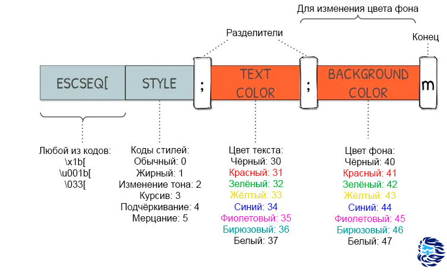
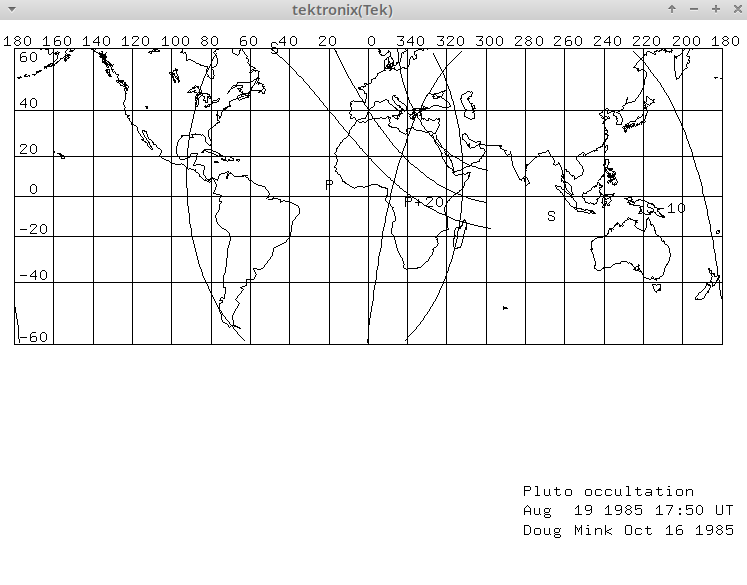
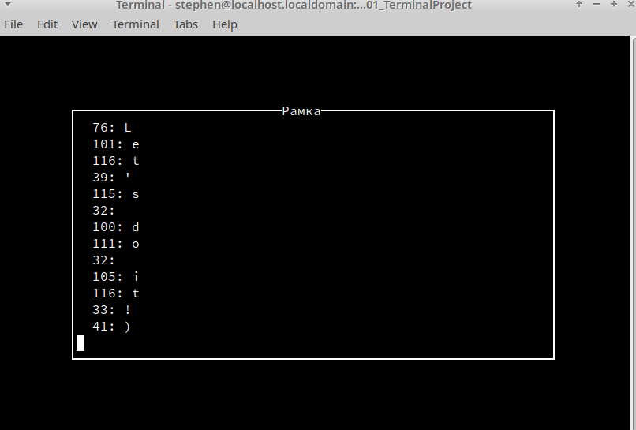

   Данный раздел будет посвящён основному устройству, через которое так или иначе проводится всё взаимодействие с кишочками компьютера руками программиста - терминалу. Так сказать, от человеческих целей что-то сделать компьютером до непосредственной реализации этого чего-то, терминал это самый простой способ.
   
# Немного теории про терминал

Терминал - это устройство, которое обеспечивает ввод-вывод байтов на компьютер. Ровным счётом, всё. Никаких волшебных свойств, накрученных механизмов. Просто что-то, куда можно вводить байты и откуда их можно получать, плюс минимальная подкапотная обработка для перевода с символьного языка на машинные команды.


Работать с компьютером вслепую было очень неудобно. Да, у тебя есть куча перфокарт, которые можно заранее под каждое действие компьютера прописать, но человеческий фактор никто не отменял, и хотелось бы при возникновении какой-то ошибки не перечитывать выколотые точки на бумажке и не искать, где какая информационная лампочка у компьютера загорелась, а вот в одно место куда-то получать ответ. А если с этого места можно будет эти самые команды компьютеру передавать вместо кучи перфокарт, так ещё и делать это прямо во время работы, жить стало бы сильно проще.

Первым терминалом стал [Телетайп](https://ru.wikipedia.org/wiki/Телетайп). Он представлял собой пишущую машинку, подключённую к компьютеру, которая печатает на бумажку текст, после чего этот текст можно было автоматически загнать в компьютер, он обрабатывался, как последовательность байт, отрабатывал команду, после чего на бумажку выводил ответ.

Это нововведение в те годы произвело невероятный скачок в работе с ЭВМ. Ничего роднее пишущей машинки для человека того времени не было. Более того, было понятно, как и эту вещь можно дальше улучшать и модифицировать. С приходом в общее пользование электронно-лучевых трубок бумажная лента заменилась на экран, но идеи, которые вложили тогда для работы через терминал, живут и актуальны до сих пор. Просто потому что лучше придумывать и не надо, всё уже максимально адаптировано.

Телетайпы стали настолько неотъемлемой частью компьютера, что современные технологии кишат отсылками на это явление:
1. Порты в файловой системе Unix-подобных систем до сих пор называются `/dev/tty` как сокращение от `/devices/teletypes`
2. `telnet` — сетевой протокол для реализации текстового терминального интерфейса по сети - также имеет своё название именно благодаря телетайпам (***teletype network***)

Также ещё с тех времён остались классические текстовые построчные редакторы. Да, "на листочке" работу с полным файлом трудно делать.  А построчно смотреть, изменять итд - вполне))

Рассмотрим небольшой примерчик с использованием одного из таких редакторов `ed`

```console
admin@localhost:~> cat text
First str
Second str
Third str
admin@localhost:~> ed -p 'ed> ' text    # 'ed> ' — подсказка в диалоге редактора
31                                      # Размер файла
ed> 3                                   # Перейдём к третьей строке
Third str
ed> i                                   # Вставим текст перед ней
Hehehe
.                                       # Единственная точка в строке — конец ввода
ed> ,p                                  # Выведем весь текст
First str                               #   полный фомат: <начало>,<конец>p
Second str                              #   по умолчанию — начало и конец файла
Hehehe
Third str
ed> 1                                   # Перейдём к перводй строке
First str
ed> s/First/Hahaha/                     # Заменим First на Hahaha
ed> .                                   # Выведем текущую строку
Hahaha str
ed> ,p                                  # Выведем весь текст
Hahaha str
Second str
Hehehe
Third str
ed> w                                   # Запишем обратно в файл…
39
ed> q                                   # …и выйдем
admin@localhost:~> cat text 
Hahaha str
Second str
Hehehe
Third str
admin@localhost:~> 
```

Управление через терминал
---

Итак, с историей всё понятно. Основная мысль: "Терминал - основа управления компьютером". Но отсюда идёт логичный вопрос: а как управлять? Просто писать команды? А если я хочу просто текст в виде команды написать, а не команду? Нужно как-то отделять, когда мы вводим просто символы, а когда управляющие команды.

Именно с такими размышлениями разработчики той самой логики работы терминала выделили некоторые байты в качестве управляющих, а, в последствии, к ним добавились и целые наборы символов. Так появился термин "Escape-последовательность" *(EscSeq далее по тексту)*, обозначающий те самые управляющие команды, которые вводились ровно так же, как и обычные байты, но обрабатывались компьютером иначе отдельно от текста. Так, н-р, EcsSeq `Ctrl+C` воспринимается, как сигнал прерывания обработки текущей команды.

Полный список управляющих байт, обрабатываемых при работе в терминале, а также другие его характеристики можно посмотреть с помощью команды `stty`

`admin@localhost:~> stty -a`
`speed 38400 baud; rows 24; columns 80; line = 0;`
`intr = ^C; quit = ^\; erase = ^?; kill = ^U; eof = ^D; eol = <undef>;`
`eol2 = <undef>; swtch = <undef>; start = ^Q; stop = ^S; susp = ^Z; rprnt = ^R;`
`werase = ^W; lnext = ^V; discard = ^O; min = 1; time = 0;`
`-parenb -parodd -cmspar cs8 -hupcl -cstopb cread -clocal -crtscts`
`-ignbrk -brkint -ignpar -parmrk -inpck -istrip -inlcr -igncr icrnl ixon -ixoff`
`-iuclc -ixany -imaxbel iutf8`
`opost -olcuc -ocrnl onlcr -onocr -onlret -ofill -ofdel nl0 cr0 tab0 bs0 vt0 ff0`
`isig icanon iexten echo echoe echok -echonl -noflsh -xcase -tostop -echoprt`
`echoctl echoke -flusho -extproc`

Всё из тех же времён пишущих машинок в современные терминалы дотянулись основные преобразования ввода-вывода:
1. Разные режимы работы с вводом - `Cooked mode` и `raw mode`.
	Работа терминала "на бумажке" предполагала сначала ввод команды, а после запуск её в обработку (`cooked mode`). В случае с электронной обработкой стала доступна возможность сразу обрабатывать вводимые символы и EcsSeq без подтверждения ввода(`raw mode`)
2. Игры с переводом строки
	В процессе записи команды с использованием пишущей машинки была возможность перемещать каретку по шагам табуляции или просто в начало, а также ставить обозначения конца строки отметками от той самой каретки. Идеи сохранились и сейчас в виде EscSeq и отдельных управляющих символов. Правда, тут есть проблемы с унификацией: у одного только Windows есть 5 вариантов символаконца строки... В Linux получше, однако их вид, увы, не унифицирован от системы к системе
3. Примитивное редактирование ввода-вывода
	Для редактирования текста в пишущей машинке использовались возможности сдвига каретки; так, например, для подчёркивания символа каретку отгоняли назад и печатали подчёркивание поверх (`хе, получается "под низ"`) символа, длясоздания жирного шрифта делали множественную повторную печать. В современных терминалах такие изменения ровно так же и отмечаются
	
	```
	TODO:  Написать пример с показанией старого формата редактирования
	```

	Сейчас такое же  редактирование можно повторить и с помощью EcsSeq:

```
admin@localhost:~> bold=$(tput bold)
admin@localhost:~> normal=$(tput sgr0)
admin@localhost:~> echo "Really ${bold}bold${normal} text" > text
admin@localhost:~> cat text 
```
Really **bold** text
```
admin@localhost:~> hexdumb -C text 
 hexdumb: command not found
admin@localhost:~> hexdump -C text 
00000000  52 65 61 6c 6c 79 20 1b  5b 31 6d 62 6f 6c 64 1b  |Really .[1mbold.|
00000010  28 42 1b 5b 6d 20 74 65  78 74 0a                 |(B.[m text.|
0000001b
```

Игры с Escape-последовательностями
---

EscSeq решили огромную кучу проблем с придумыванием того, как запускать какие-то компьютерные алгоритмы. Логика стала максимально унифицированной: Хочешь что-то обработать - просто нажми подряд несколько символов, и всё готово!

Информацию про все тонкости нашего терминала и доступных ему EscSeq можно посмотреть с помощью команды `infocmp`

```
admin@localhost:~> infocmp vt52
#	Reconstructed via infocmp from file: /usr/share/terminfo/v/vt52
vt52|DEC VT52,
	cols#80, it#8, lines#24,
	acsc=+h.k0affggolpnqprrss, bel=^G, clear=\EH\EJ, cr=\r,
	cub1=\ED, cud1=\EB, cuf1=\EC,
	cup=\EY%p1%' '%+%c%p2%' '%+%c, cuu1=\EA, ed=\EJ, el=\EK,
	home=\EH, ht=^I, ind=\n, ka1=\E?q, ka3=\E?s, kb2=\E?r, kbs=^H,
	kc1=\E?p, kc3=\E?n, kcub1=\ED, kcud1=\EB, kcuf1=\EC,
	kcuu1=\EA, kf0=\E?y, kf1=\EP, kf2=\EQ, kf3=\ER, kf5=\E?t,
	kf6=\E?u, kf7=\E?v, kf8=\E?w, kf9=\E?x, nel=\r\n, ri=\EI,
	rmacs=\EG, rmkx=\E>, smacs=\EF, smkx=\E=, u8=\E/[KL], u9=\EZ,

```

С помощью EscSeq реализованы все возможные операции с терминалом: печать в любом месте экрана, работа с текстом. В частности, на EscSeq построена поддержка цветных текстов в терминале.




А на экранном [Tektronix_4010](https://en.wikipedia.org/wiki/Tektronix_4010) с помощью EscSeq было возможно рисовать картинки:
```
cat map.tek.xterm
```



NCurses и работа с Escape-последовательностями в C
---

Попробуем применить EscSeq, не явно вводя их ручками в терминал, а используя внутри своей программы.
Терминальный Shell позволяет нам создавать какие-то простые программки в терминале с помощью программы `dialog`

```
admin@localhost:~> dialog --yesno "Пробная программа" 30 40
```


Но мы будем пользоваться всем этим багажом терминала на C. Специально для этого разработана библиотека [***NCurses***](http://grep.cs.msu.ru/dkhramov/Comp.NcursesTutorial.html) (А вот [тут](https://invisible-island.net/ncurses/#packages) можно посмотреть релизы, скачать исходники)

Идея работы с библиотекой такая: считаем, что у нас есть экран - прямоугольник терминального окна. Мы его как-то заполняем, обновляем, и экран у нас отображается. На экране можно создавать окна, настраивать их и работать с ними.

Пример:
```
#include <curses.h>
main ()
{
        initscr ();
        move (LINES/2 - 1, COLS/2 - 4);
        addstr ("Hello, World!");
        getch ();
        endwin ();
}
```

Разберём, что делает данная программа, а заодно разберёмся с основными функциями:
1. Для запуска движка `curses` и инициализации экрана используется функция `initscr()`, парная с функцией отключения движка `endwin()`. При этом  в глобальные переменные `LINES` и `COLS` записываются размеры нашего экрана;
2. Мы можем двигать курсор по экрану в любое место с помощью функции `move()`;
3. Для того, чтобы обновить экран для проецирования внесённых изменений используется команда `refresh()`. Однако если мы будем использовать её, программа отработает обновление, а далее сразу завершится. Поэтому мы используем `getch()` - команду, которая ожидает пользовательскую реакцию (любой символ; *`getch - get char`*), но перед этим, очевидно, обновляет экран.

Компиляция программы проводится с помощью флага присоединения библиотеки `-lcurses`

```
cc curses.c -lcurses -o curses
./curses
```

И на выходе мы получаем нашу первую программу по ***NCurses***


На практике нам хочется уметь работать не только с английскими символами, соответственно, нам нужна будет обработка локалей(переводов, если не вдаваться в подробности), поэтому устанавливаем библиотеку `locale.h` и компилируем теперь с флагом библиотеки `-lncursesw`


***TODO:*** 
==Исправить проблему примера: печатаем границы окна в окне, отчего нужно перерисовывать границу, она едет вместе со скроллингом==

Следующим примером разберём встроенные окна. Работа с ними ведётся через указатели на специальную структуру WINDOW.

```
#include <curses.h>
#include <locale.h>

int main(void) {
	WINDOW* win;
	char c = 0;

	setlocale(LC_ALL, "");

	initscr();
	noecho();
	cbreak();

	move(4, 10);
	printw("window:");
	refresh();

	win = newwin(LINES - 10, COLS - 20, 5, 10);
	keypad(win, TRUE);
	scrollok(win, TRUE);

	box(win, 0, 0); // TODO
	wmove(win, 1, 1);

	while((c = wgetch(win)) != 27) {
		wprintw(win, "  %d: %s\n", c, keyname(c));
		box(win, 0, 0);
		wrefresh(win);
	}

	delwin(win);
	endwin();
	return 0;
}


```

Здесь у нас снова новые функции из библиотеки:
1. Создание и удаление экранного окна происходит парными функциями `newwin()` и `delwin()`
2. С помощью `keypad()` и `scrollok()` задаём свойства окна: взаимодействие с клавиатурой и возможность его листать
3. `box()` рисует для нашего окна красивую каёмку
4. Также в программе используются оконные аналоги чтения и обновления экрана.

Что же мы получаем? 
```
cc big_curses.c -lncursesw -o big_curses
./big_curses
```



Оно пишет, Карл! И двигается!

И напоследок - Автосборка
---

Наши примеры не требовали каких-то сложных команд для компиляции программы. Однако так бывает далеко не всегда. Вернее, почти всегда не бывает. И чтобы каждыцй раз вручную не перекомпилировать 100500 файлов, а уж, тем более, чтобы не проверять, какие из них поменялись, какие остались теми же итд, существуют утилиты автоматической сборки, которые проверяют и перекомпилируют файлы за нас по заданным шаблонам. Мы будем обсуждать утилиту ***make*** и её ***Makefile***

Мейк-файл - это сборник рецептов по тому, как собирать из одних исходников другие, из других - третьи итд
Рассмотрим вариант ***Makefile*** нашей программы. По своей структуре он состоит из команд и переменных *Shell*.  Обращение к командам выполняется через задание *целей*, внутри которых можно тоже генерировать объекты и связанные имена

```
CC=cc
LDLIBS=-lncursesw
CFLAGS=-Wall

%:	%.c
	$(CC) $(CFLAGS) $< $(LDLIBS) -o $@
```

**Что происходит:**
1. Задали переменные
2. Пишем цель мейка: какое-то приходящее аргументом слово (подразумевается название нашей программы), от него у нас будет генерироваться имя с расширением `.c`
3. Внутри цели у нас написан набор команд, которые должны быть выполнены. Команды могут задаваться явно, а могут через переменные, как у нас. При этом мы можем использовать временные аргументы - `$<` для пришедшего аргумента и `$@` для сгенерированного имени

**Важные ограничения:**
1. *Связано с работой самой утилиты: *Обязательно используется ТАБУЛЯЦИЯ. Увы, чисто пробелами мы не обойдёмся; вспоминаем наши телетайпы из начала раздела, их табличные фиксаторы, для которых была отдельная кнопка, понимаем, что нам нужен именно спецсимвол, а не сдвиг для работы ***make***
2. *Связано с работой компилятора, который мы вызываем:* Порядок аргументов в нём важен, сначала идёт программа, потом библиотека, тк сначала мы должны обработать файл, где есть неизвестные нам параметры, а уже после этого эти неизвестные параметры покрыть данными из присоединяемой библиотеки

Что же мы получаем? Удобный интерфейс по компиляции файлов, который сам проверяет актуальность сборки и делает её лишь по необходимости

```
admin@localhost:~/LinuxAppDev/01_TerminalProject> make curses
make: 'curses' is up to date.
admin@localhost:~/LinuxAppDev/01_TerminalProject> make big_curses
cc -Wall big_curses.c -lncursesw -o big_curses
admin@localhost:~/LinuxAppDev/01_TerminalProject> 

```

У ***make*** есть возможность вызова целей не только связаных внешними объектами, но и просто с командами

При работе по умолчанию ищется первая непараметризованная цель ИЛИ цель по умолчанию `all`

Также в нём есть огромное количество прописанных под специальные имена переменных паттерны обработки, благодаря чему можно просто задавать переменные и пользоваться встроенными алгоритмами

```
SRC=curses.c
EXE=curses
CC=cc
LDLIBS=-lncursesw
CFLAGS=-Wall

all:	curses

clean:
	rm -f o oo ${EXE} *.o
```

```
admin@localhost:~/LinuxAppDev/01_TerminalProject> make clean
rm -f o oo curses *.o
admin@localhost:~/LinuxAppDev/01_TerminalProject> make
cc -Wall    curses.c  -lncursesw -o curses
admin@localhost:~/LinuxAppDev/01_TerminalProject> 
```

Домашнее Задание
---

1. С помощью интернета и здравого смысла написать на `ncurses` программу ***Show.c***, которая постранично просматривает файл (слишком длинные строки усекаются или переносятся — как вам удобнее).
    - Имя файла передавать параметром командной строки.
    - Файл должен показываться в окне, а в первой строке экрана должно содержаться его имя.
    - Весь файл _допустимо_ хранить в памяти, например, одним куском или в виде списка строк.
    - При нажатии *пробела* файл прокручивается дальше (если есть такая возможность), при нажатии `ESC` программа завершается.
        - Имеет смысл очищать окно при помощи `werase()`, а потом всё заново на нём выводить.
    - Многобайтовую кодировку можно не поддерживать
    - Исполняемый файл должен называться `Show`

2. Сделать `Makefile` и добиться работоспособности `make`
